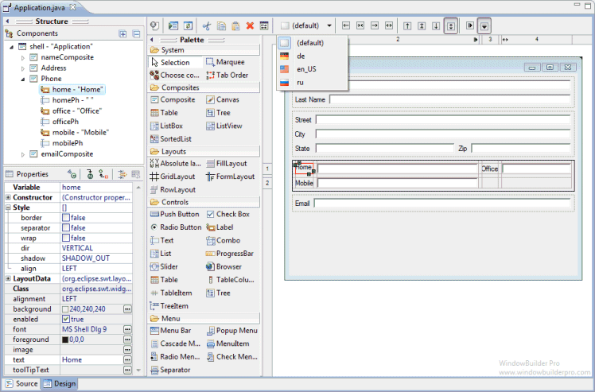



# WindowBuilder | A powerful, easy-to-use, bi-directional Java GUI designer


 WindowBuilder is composed of SWT Designer and Swing Designer and makes it very easy to create Java GUI applications without spending a lot of time writing code. Use the WYSIWYG visual designer and layout tools to create simple forms to complex windows; the Java code will be generated for you. Easily add controls using drag-and-drop, add event handlers to your controls, change various properties of controls using a property editor, internationalize your app and much more.

WindowBuilder is built as a plug-in to Eclipse and the various Eclipse-based IDEs (RAD, RSA, MyEclipse, JBuilder, etc.). The plug-in builds an abstract syntax tree (AST) to navigate the source code and uses GEF to display and manage the visual presentation.

Generated code doesn't require any additional custom libraries to compile and run: all of the generated code can be used without having WindowBuilder installed. WindowBuilder can read and write almost any format and reverse-engineer most hand-written Java GUI code. It also supports free-form code editing (make changes anywhere, not just in special areas) and most user refactorings (you can move, rename and subdivide methods without a problem).

